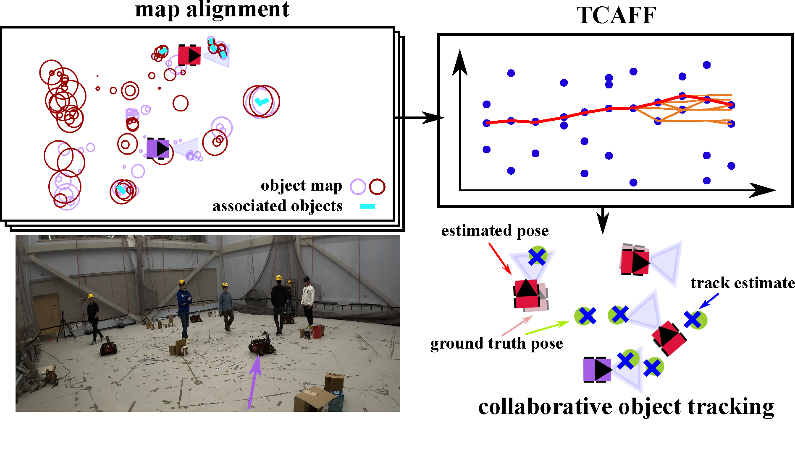

## MOTLEE: <ins>M</ins>ulti-<ins>O</ins>bject <ins>T</ins>racking with <ins>L</ins>ocalization <ins>E</ins>rror <ins>E</ins>limination

MOTLEE is an algorithm used for performing collaborative multi-object tracking (MOT) in read-world environments (i.e. in the presence of imperfect localization). 
This involves performing data association of object measurements with tracked targets, sharing information across a distributed network, and filtering shared information for an accurate estimate. 
This implementation of MOT adopts the track management system of [Casao et al.](https://arxiv.org/abs/2010.13701).
Importantly, MOTLEE involves performing frame alignment between pairs of robot to correct for localization drift using maps of static landmarks and dynamic object detections. 

This repo contains code for performing multi-object tracking (useful for both collaborative or single-agent cases) and frame alignment between robots.

# Installation

The `motlee` Python package can be installed with:

```
cd <this rep>
pip install .
```

Note: to install open3d 0.17.0, you may need to run:

```
pip install --upgrade pip
```

# Examples

A growing number of examples for using `motlee` can be found in the [examples directory](./examples/).

