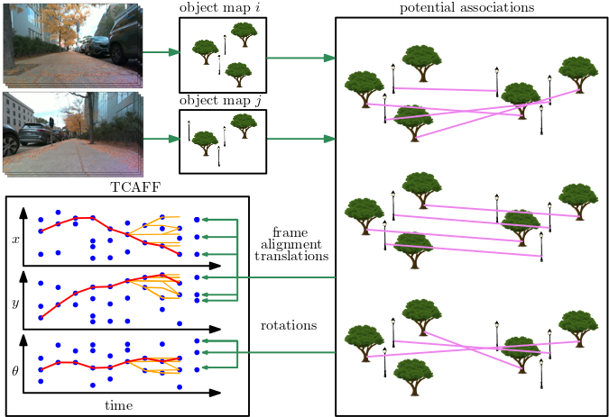

# TCAFF: Temporally Consistency for Robot Frame Alignment



TCAFF (temporally consistent alignment of frames filter) is a novel multiple hypothesis algorithm for aligning the coordinate frames of neighboring robots.
TCAFF considers potential alignments from associating sparse, open-set object maps and leverages temporal consistency to determine an initial alignment and correct for drift, all without any initial knowledge of neighboring robot poses.

This repo contains code for aligning frames using TCAFF as well as an example application of using TCAFF while performing collaborative multi-object tracking on a dataset of four robots tracking six pedestrians (see [below](#dataset) for access to our dataset).


# Citation

If you use this code in your research, please cite our paper, which will be released soon.

# Installation

The `tcaff` Python package can be installed with:

```
cd <this rep>
pip install .
```

Additionally, the steps for installing [CLIPPER](https://github.com/mit-acl/clipper) should be followed:

```
git clone git@github.com:mit-acl/clipper.git
cd clipper
mkdir build
cd build
cmake ..
make
make pip-install
```

# Running

After downloading the TCAFF MOT dataset, the demo can be run with the following commands (after `cd`ing into this repo):

```
mkdir results
python3 ./demo/demo.py --params ./demo/params/tcaff_mot_dataset.yaml --output ./results/tcaff_mot_dataset.png
```
For the code to recognize the dataset this environment variable should be set:
```
export TCAFF_MOT_DATASET=<path to dataset>
```

# Dataset

The TCAFF MOT dataset of four robots/six pedestrian object tracking experiment associated with the TCAFF paper can be obtained by filling out [this Google Form](https://forms.gle/aKoQqBDXJVYe38mK9).

# Acknowledgements

TCAFF was supported by the Ford Motor Company and by ARL DCIST.


